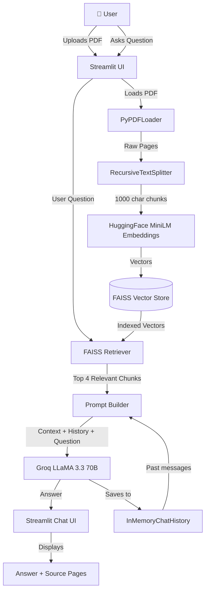
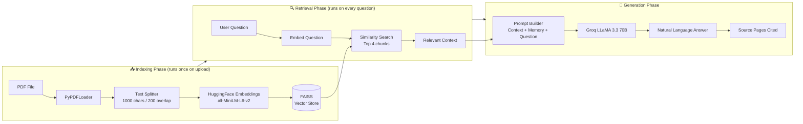
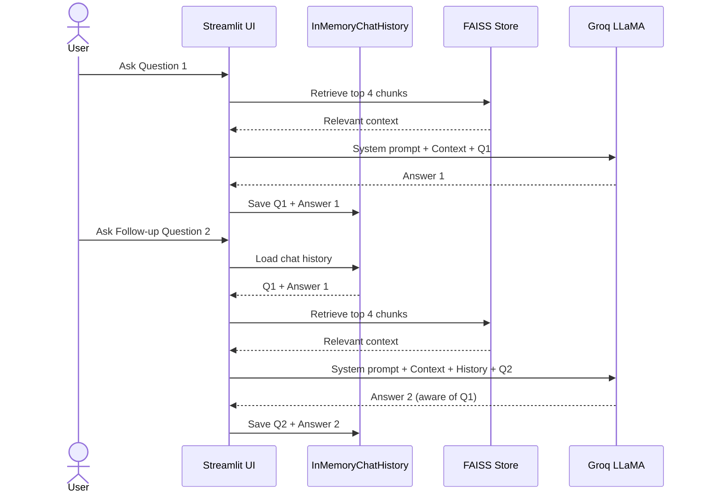

# 📄 Chat with PDF
> Ask questions about any PDF in plain English — powered by **Groq LLaMA 3.3 70B**, **LangChain**, and **FAISS**


---

## 🚀 Demo

Upload any PDF → Ask questions → Get instant answers with source pages cited.

---

## 🧠 Architecture Overview



---

## 🔄 RAG Pipeline



---

## 💬 Conversation Memory Flow



---

## 🛠️ Tech Stack

| Layer | Technology | Purpose |
|---|---|---|
| 🖥️ UI | Streamlit | Chat interface |
| 🤖 LLM | Groq LLaMA 3.3 70B | Answer generation |
| 🔗 Framework | LangChain v1 | Orchestration |
| 📐 Embeddings | HuggingFace MiniLM | Text → Vectors |
| 🗄️ Vector Store | FAISS | Similarity search |
| 📄 PDF Loader | PyPDF | Extract text |
| 🧠 Memory | InMemoryChatHistory | Conversation context |
| ⚡ Caching | InMemoryCache | Skip repeated LLM calls |

---

## 📁 Project Structure

```
chat_with_pdf/
├── .env                  # API keys (never commit)
├── .env.example          # Template for API keys
├── .gitignore            # Excludes .env and .venv
├── pyproject.toml        # Dependencies
├── app.py                # Main Streamlit application
└── README.md             # This file
```

---

## ⚙️ Setup & Installation

### Prerequisites
- Python 3.11+
- [uv](https://docs.astral.sh/uv/) package manager
- Free [Groq API key](https://console.groq.com)

### Step 1 — Clone the repo
```bash
git clone https://github.com/yourusername/chat-with-pdf.git
cd chat-with-pdf
```

### Step 2 — Create virtual environment
```bash
uv venv --python 3.11
source .venv/bin/activate    # Mac/Linux
.venv\Scripts\activate       # Windows
```

### Step 3 — Install dependencies
```bash
uv sync
```

### Step 4 — Set up environment variables
```bash
cp .env.example .env
# Edit .env and add your Groq API key
```

```bash
# .env
GROQ_API_KEY=your_groq_api_key_here
```

### Step 5 — Run the app
```bash
streamlit run app.py
```

Opens at `http://localhost:8501` 🚀

---

## 💡 Usage

1. **Upload a PDF** using the sidebar file uploader
2. **Wait** for indexing to complete (shows chunk count)
3. **Ask questions** in plain English in the chat input
4. **View source pages** by expanding "📖 Source Pages Used"
5. **Ask follow-ups** — the app remembers conversation history
6. **Clear chat** using the sidebar button to start fresh

### Example Questions
```
"What is this document about?"
"Summarize the key points"
"What does it say about X on page 5?"
"What are the main conclusions?"
"Tell me more about the first point you mentioned"
```

---

## ✨ Features

| Feature | Description |
|---|---|
| 💬 Chat Interface | Full conversational UI with message history |
| 🧠 Memory | Remembers previous questions for follow-ups |
| 📖 Source Pages | Shows exactly which pages were used to answer |
| ⚡ LLM Caching | Skips LLM call for repeated questions |
| 🔄 Fallback Model | Switches to Mixtral if primary model fails |
| 🔒 Stays in PDF | Never answers outside the document context |
| ❌ Error Handling | Catches and displays errors gracefully |
| 🗑️ Clear Chat | Reset conversation while keeping PDF loaded |

---

## 🔒 Security

- API keys stored in `.env` — **never committed to git**
- `.env` is listed in `.gitignore`
- Use `.env.example` as a template with no real values

---

## 🚧 Limitations

- PDF must contain selectable text (scanned PDFs not supported)
- Vector store is in-memory — resets on app restart
- Free Groq tier has rate limits — may slow on heavy usage

---

## 🗺️ Future Roadmap


## 🙏 Acknowledgements

- [LangChain](https://langchain.com) — LLM orchestration framework
- [Groq](https://groq.com) — Ultra-fast free LLM inference
- [HuggingFace](https://huggingface.co) — Free embedding models
- [FAISS](https://faiss.ai) — Facebook AI similarity search
- [Streamlit](https://streamlit.io) — Python web UI framework

Author
Keerthi Vinukonda
LinkedIn Profile : https://www.linkedin.com/in/keerthi-v-4022a8263/
GitHub link : https://github.com/keerthihp96
